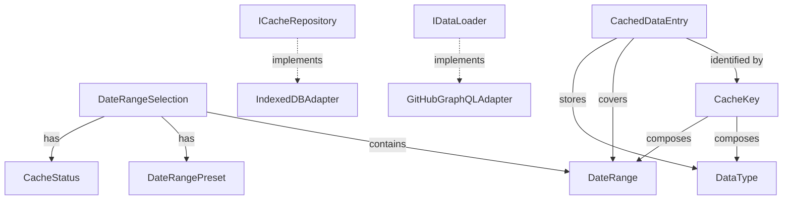

# Data Model: Progressive Data Loading

**Feature**: 007-progressive-loading
**Date**: 2026-02-06
**Status**: Complete

This document defines all domain entities, value objects, and their relationships for the progressive loading feature.

---

## Domain Layer Overview

The progressive loading feature introduces two primary domain concepts:

1. **Caching Layer**: Persistent storage of GitHub data with TTL and metadata
2. **Date Range Management**: User-selected time periods with preset support

**Note**: Loading state is managed at component-level using React useState/useTransition (no global state management library).

---

## Entities

### CachedDataEntry

**Purpose**: Represents a cached data segment in IndexedDB with metadata for staleness detection and LRU eviction.

**Properties**:

| Property       | Type        | Validation                     | Description                                                          |
| -------------- | ----------- | ------------------------------ | -------------------------------------------------------------------- |
| key            | `CacheKey`  | Required                       | Unique identifier: `{owner}/{repo}:{dataType}:{startDate}:{endDate}` |
| repositoryId   | `string`    | Required, format: `owner/repo` | GitHub repository identifier                                         |
| dataType       | `DataType`  | Required                       | Type of cached data (PRs, deployments, commits)                      |
| dateRange      | `DateRange` | Required                       | Time period covered by this cache entry                              |
| data           | `unknown`   | Required                       | Serialized JSON payload (PRs, deployments, releases)                 |
| cachedAt       | `Date`      | Required                       | Timestamp when data was cached                                       |
| expiresAt      | `Date`      | Required                       | TTL expiration timestamp                                             |
| lastAccessedAt | `Date`      | Required                       | For LRU eviction strategy                                            |
| size           | `number`    | Required, > 0                  | Estimated bytes for quota management                                 |
| isRevalidating | `boolean`   | Required, default: false       | Background refresh in progress                                       |

**Validation Rules**:

- `expiresAt` must be after `cachedAt`
- `size` must be positive integer
- `data` must be valid JSON (Zod schema validation)
- `key` must match format: `{repositoryId}:{dataType}:{dateRange.start}:{dateRange.end}`

**Invariants**:

- Once created, `key` and `repositoryId` are immutable
- `lastAccessedAt` updates on every read operation
- `isRevalidating` flag prevents duplicate background fetches

**Factory Methods**:

```typescript
static create(
  repositoryId: string,
  dataType: DataType,
  dateRange: DateRange,
  data: unknown
): Result<CachedDataEntry>

static fromIndexedDB(raw: unknown): Result<CachedDataEntry>
```

---

### DateRangeSelection

**Purpose**: Represents user's selected time period for data visualization with cache availability metadata.

**Properties**:

| Property    | Type              | Validation | Description                                           |
| ----------- | ----------------- | ---------- | ----------------------------------------------------- |
| range       | `DateRange`       | Required   | Start and end dates                                   |
| preset      | `DateRangePreset` | Optional   | Preset type if selected (Last7Days, Last30Days, etc.) |
| cacheStatus | `CacheStatus`     | Required   | Cache hit/miss/stale indicator                        |
| lastUpdated | `Date`            | Optional   | When cached data was last refreshed                   |

**Validation Rules**:

- If `preset` is set, `range` must match preset definition
- `lastUpdated` must be in the past (≤ now)
- `cacheStatus` must be "miss" if `lastUpdated` is null

**Invariants**:

- `preset` and `range` must stay synchronized (changing preset updates range)
- `cacheStatus` recomputed on every access based on TTL

**Factory Methods**:

```typescript
static fromPreset(preset: DateRangePreset): DateRangeSelection

static fromCustomRange(start: Date, end: Date): DateRangeSelection

static withCacheStatus(
  current: DateRangeSelection,
  status: CacheStatus,
  lastUpdated?: Date
): DateRangeSelection
```

---

## Value Objects

### CacheKey

**Purpose**: Unique identifier for cache entries combining repository, data type, and date range.

**Format**: `{owner}/{repo}:{dataType}:{startISO}:{endISO}`

**Example**: `facebook/react:prs:2024-01-01T00:00:00Z:2024-01-31T23:59:59Z`

**Properties**:

- `value`: `string` (readonly, immutable)

**Validation**:

- Must match regex: `^[\w-]+/[\w-]+:(prs|deployments|commits):\d{4}-\d{2}-\d{2}T[\d:]+Z:\d{4}-\d{2}-\d{2}T[\d:]+Z$`

**Methods**:

```typescript
static create(
  repositoryId: string,
  dataType: DataType,
  dateRange: DateRange
): Result<CacheKey>

static parse(value: string): Result<CacheKey>

equals(other: CacheKey): boolean

toString(): string
```

---

### DateRange

**Purpose**: Represents a time period with start and end dates, ensuring temporal validity.

**Properties**:

| Property | Type   | Validation | Description              |
| -------- | ------ | ---------- | ------------------------ |
| start    | `Date` | Required   | Beginning of time period |
| end      | `Date` | Required   | End of time period       |

**Validation Rules**:

- `end` must be after `start`
- Both dates must be valid (not NaN)
- `start` must not be in the future
- Maximum range: 2 years (730 days)

**Factory Methods**:

```typescript
static create(start: Date, end: Date): Result<DateRange>

static last7Days(): DateRange

static last30Days(): DateRange

static last90Days(): DateRange

static last6Months(): DateRange

static lastYear(): DateRange
```

**Computed Properties**:

```typescript
get durationDays(): number

contains(date: Date): boolean

overlaps(other: DateRange): boolean

split(chunkDays: number): DateRange[]
```

---

## Enums (String Literal Type Pattern)

### DataType

**Purpose**: Types of data that can be cached.

```typescript
export const DataType = {
  PRS: "prs",
  DEPLOYMENTS: "deployments",
  COMMITS: "commits",
} as const;
export type DataType = (typeof DataType)[keyof typeof DataType];
```

---

### CacheStatus

**Purpose**: Cache hit/miss/stale indicator.

```typescript
export const CacheStatus = {
  HIT_FRESH: "hit_fresh", // Cached data within TTL
  HIT_STALE: "hit_stale", // Cached data expired but served
  MISS: "miss", // No cached data available
  REVALIDATING: "revalidating", // Serving stale while fetching fresh
} as const;
export type CacheStatus = (typeof CacheStatus)[keyof typeof CacheStatus];
```

---

### DateRangePreset

**Purpose**: Predefined date range options for UI.

```typescript
export const DateRangePreset = {
  LAST_7_DAYS: "last_7_days",
  LAST_30_DAYS: "last_30_days",
  LAST_90_DAYS: "last_90_days",
  LAST_6_MONTHS: "last_6_months",
  LAST_YEAR: "last_year",
  CUSTOM: "custom",
} as const;
export type DateRangePreset =
  (typeof DateRangePreset)[keyof typeof DateRangePreset];
```

---

## Repository Interfaces (Domain Layer)

### ICacheRepository

**Purpose**: Abstraction for cache storage operations (IndexedDB in infrastructure layer).

```typescript
export interface ICacheRepository {
  /**
   * Retrieve cached data by key
   * @returns CachedDataEntry if found and valid, null otherwise
   */
  get(key: CacheKey): Promise<CachedDataEntry | null>;

  /**
   * Store data in cache with TTL
   * @throws if storage quota exceeded
   */
  set(entry: CachedDataEntry): Promise<void>;

  /**
   * Remove specific cache entry
   */
  delete(key: CacheKey): Promise<void>;

  /**
   * Remove all cache entries for a repository
   */
  clearRepository(repositoryId: string): Promise<void>;

  /**
   * Remove all cached data
   */
  clearAll(): Promise<void>;

  /**
   * Get all cache entries (for LRU eviction)
   */
  getAll(): Promise<CachedDataEntry[]>;

  /**
   * Get cache statistics
   */
  getStats(): Promise<CacheStats>;
}

export interface CacheStats {
  totalEntries: number;
  totalSizeBytes: number;
  oldestEntry: Date | null;
  newestEntry: Date | null;
}
```

---

### IDataLoader

**Purpose**: Abstraction for data fetching operations (GitHub GraphQL API in infrastructure layer).

```typescript
export interface IDataLoader {
  /**
   * Fetch PRs for a date range
   * @param signal AbortSignal for cancellation
   */
  fetchPRs(
    repositoryId: string,
    dateRange: DateRange,
    signal?: AbortSignal,
  ): Promise<Result<PullRequest[]>>;

  /**
   * Fetch deployments for a date range
   * @param signal AbortSignal for cancellation
   */
  fetchDeployments(
    repositoryId: string,
    dateRange: DateRange,
    signal?: AbortSignal,
  ): Promise<Result<DeploymentEvent[]>>;

  /**
   * Fetch commits for a date range
   * @param signal AbortSignal for cancellation
   */
  fetchCommits(
    repositoryId: string,
    dateRange: DateRange,
    signal?: AbortSignal,
  ): Promise<Result<Commit[]>>;
}
```

---

## Entity Relationships



---

## Data Flow

### 1. Initial Load (30 Days)

```
User Opens Dashboard
  ↓
DateRangeSelection.fromPreset(LAST_30_DAYS)
  ↓
CacheKey.create(repo, DataType.PRS, last30Days)
  ↓
ICacheRepository.get(key) → HIT_FRESH or MISS
  ↓ (if MISS)
IDataLoader.fetchPRs(repo, last30Days, abortSignal)
  ↓
ICacheRepository.set(CachedDataEntry.create(...))
  ↓
Display Data to User
```

### 2. Background Historical Load

```
Initial Load Complete
  ↓
Component calls startTransition(() => loadHistorical())
  ↓ (Component-level state: isPending = true)
For each chunk (31-120, 121-210, 211-365 days):
  ├─ Check abortSignal.aborted → break if true
  ├─ IDataLoader.fetchPRs(repo, chunkRange, abortSignal)
  ├─ ICacheRepository.set(CachedDataEntry.create(...))
  ├─ Component updates state with new data chunk
  └─ Continue to next chunk
  ↓
Component state: isPending = false, data updated
```

### 3. Stale-While-Revalidate

```
User Visits Dashboard (cached data exists but stale)
  ↓
ICacheRepository.get(key) → HIT_STALE
  ↓
Display Cached Data (instant feedback with staleness indicator)
  ↓
Component calls startTransition(() => revalidate())
  ↓ (Component-level state: isPending = true)
(Background) IDataLoader.fetchPRs(repo, dateRange, abortSignal)
  ↓
(Background) ICacheRepository.set(updated entry)
  ↓
(Background) Component updates state with fresh data
  ↓
Component state: isPending = false, staleness indicator removed
```

---

## Validation Schemas (Zod)

### CachedDataEntrySchema

```typescript
import { z } from "zod";

export const CachedDataEntrySchema = z.object({
  key: z
    .string()
    .regex(
      /^[\w-]+\/[\w-]+:(prs|deployments|commits):\d{4}-\d{2}-\d{2}T[\d:]+Z:\d{4}-\d{2}-\d{2}T[\d:]+Z$/,
    ),
  repositoryId: z.string().regex(/^[\w-]+\/[\w-]+$/),
  dataType: z.enum(["prs", "deployments", "commits"]),
  dateRange: z
    .object({
      start: z.date(),
      end: z.date(),
    })
    .refine((data) => data.end > data.start, {
      message: "End date must be after start date",
    }),
  data: z.unknown(),
  cachedAt: z.date(),
  expiresAt: z.date(),
  lastAccessedAt: z.date(),
  size: z.number().positive().int(),
  isRevalidating: z.boolean(),
});
```

---

## Storage Estimates

| Data Type             | 100 Items | 500 Items | 2000 Items |
| --------------------- | --------- | --------- | ---------- |
| **PRs**               | ~50 KB    | ~250 KB   | ~1 MB      |
| **Deployments**       | ~20 KB    | ~100 KB   | ~400 KB    |
| **Commits**           | ~30 KB    | ~150 KB   | ~600 KB    |
| **Total (all types)** | ~100 KB   | ~500 KB   | ~2 MB      |

**Assumptions**:

- Average PR object: ~500 bytes (number, title, author, dates, additions, deletions)
- Average deployment object: ~200 bytes (id, environment, state, dates)
- Average commit object: ~300 bytes (sha, message, author, dates)

**Cache Size Limits** (from research):

- Maximum total cache size: 50 MB (configurable)
- Maximum entries: 1000 (LRU eviction)
- Browser quota: 50-100 MB per origin (Chrome), 10 MB (Safari)

---

## Next Steps

1. **Create contracts/** directory with TypeScript interface definitions
2. **Implement domain layer** entities and value objects in `src/domain/`
3. **Create application layer** use cases: LoadInitialData, LoadHistoricalData, GetCachedData
4. **Implement infrastructure layer** adapters: IndexedDBAdapter, InMemoryCacheAdapter (fallback)
5. **Build presentation layer** hooks: useProgressiveLoading (useState + useTransition), useCache

**Document Status**: Complete
**Generated**: 2026-02-06
**References**: [spec.md](./spec.md), [research.md](./research.md), [plan.md](./plan.md)
